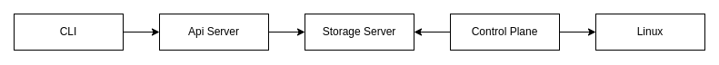

# First Container Orchestrator

My first attempt at building a container orchestrator. This project is a learning experience and is not intended to be
used in production.

## Systems

The system is composed of four main components: the control plane, the storage server, the API server, and the client.
Each component has a specific role in the system.

### Control Plane

The control plane is responsible for synchronizing the state of Linux with the state of the system.

### Storage Server

The storage server is responsible for managing the state of the system.

### API Server
The API server is a RESTful API providing an interface to the system.

#### Secure Communication
To secure communication between the API server and other components, the API server uses mutual TLS to authenticate
clients. The server uses a self-signed certificate to authenticate clients. The client must have the server's public key
to authenticate the server.

[More information about mTLS](https://www.cloudflare.com/learning/access-management/what-is-mutual-tls)

### Command Line Interface (CLI)

The CLI is a command line interface that interacts with the API server.
